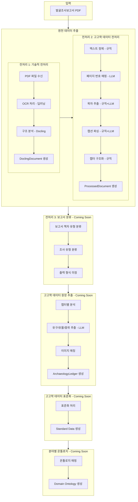
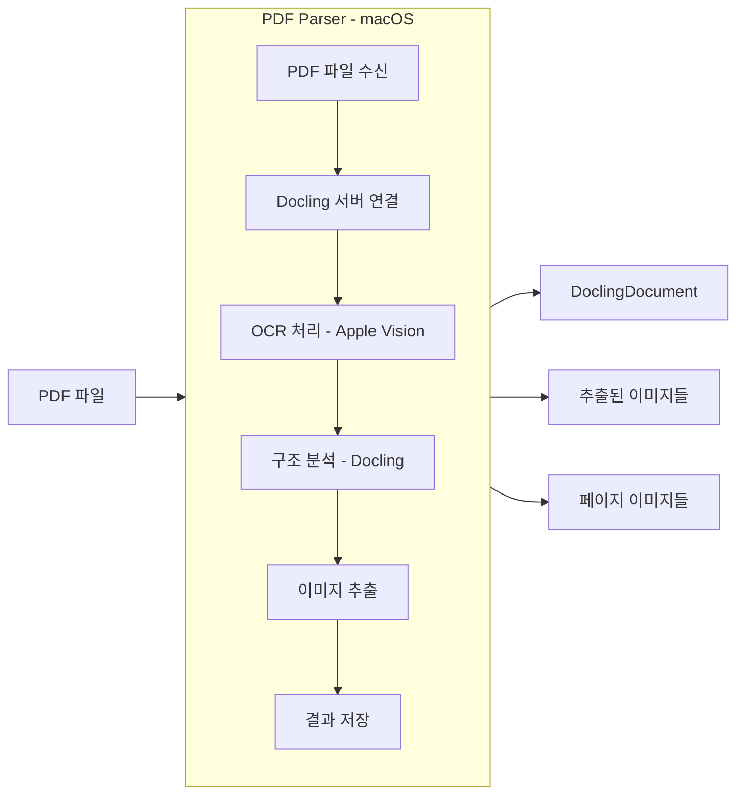
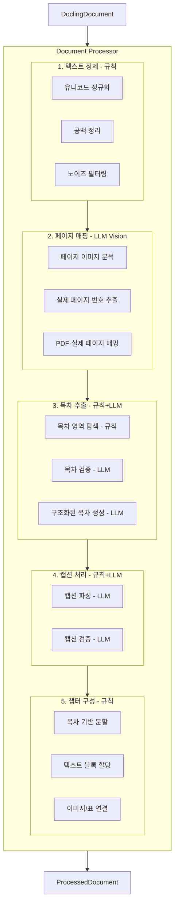
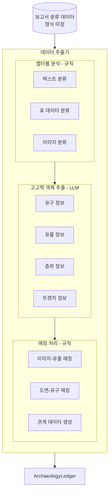
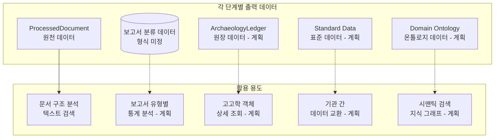

# heripo engine 아키텍처

## 프로젝트 개요

heripo engine은 **고고학 발굴조사보고서**(PDF)에서 데이터를 추출하여 구조화된 데이터베이스로 변환하는 시스템입니다.

### 왜 이 프로젝트가 필요한가?

고고학 발굴조사보고서는 수백~수천 페이지에 달하는 PDF 문서로, 다음과 같은 정보를 포함합니다:

- 발굴 현장의 층위(지층) 정보
- 발견된 유구(건물터, 무덤 등) 상세
- 출토 유물(토기, 석기 등) 목록
- 발굴 과정 사진 및 도면

이러한 정보를 수작업으로 데이터베이스에 입력하는 것은 시간과 비용이 많이 소요됩니다. heripo engine은 이 과정을 **자동화**하여 연구자들이 데이터를 빠르게 활용할 수 있도록 돕습니다.

---

## 전체 처리 흐름



---

## AI 기술 활용 구분

heripo engine은 두 가지 유형의 AI 기술을 활용합니다:

| 구분       | 기술                         | 사용 단계        | 특징                                         |
| ---------- | ---------------------------- | ---------------- | -------------------------------------------- |
| **딥러닝** | Apple Vision Framework (OCR) | 전처리 1         | 이미지에서 텍스트 인식, 로컬 처리, 비용 없음 |
| **LLM**    | GPT, Claude, Qwen 등         | 전처리 2, 본처리 | 텍스트 이해/분석, API 호출, 토큰당 비용 발생 |

### LLM 모델 선택 전략

LLM 비용을 최적화하기 위해 작업 특성에 따라 모델을 구분하여 사용합니다:

| 모델 유형              | 사용 조건                          | 예시                    |
| ---------------------- | ---------------------------------- | ----------------------- |
| **프론티어 상용 모델** | 컨텍스트가 많거나 높은 정확도 필요 | GPT-5.2, Claude Opus 등 |
| **오픈소스 모델**      | 단순 작업, 비용 효율 중시          | Qwen, DeepSeek 등       |

### LLM 검증 및 보정 체계

모든 LLM 처리 과정에는 **프론티어 상용 모델을 활용한 검증/보정 단계**가 포함됩니다:


이 체계를 통해:

- **비용 절감**: 대부분의 처리는 저비용 오픈소스 모델로 수행
- **정확도 보장**: 프론티어 모델이 결과를 검증하여 품질 확보
- **자동 보정**: 검증 실패 시 프론티어 모델이 직접 재처리

---

## 단계별 상세 설명

### 입력: 발굴조사보고서

- **형식**: PDF 파일
- **특징**:
  - 스캔된 이미지 기반 (OCR 필요)
  - 수백~수천 페이지 분량
  - 표, 사진, 도면 다수 포함
  - 한국어 텍스트 중심

---

### 전처리 1: 기술적 전처리 (`@heripo/pdf-parser`)

> **현재 구현 완료** ✅

PDF 파일을 컴퓨터가 이해할 수 있는 구조화된 데이터로 변환하는 **기술적 전처리** 단계입니다.

#### 핵심 기술: Docling

[Docling](https://github.com/DS4SD/docling)은 IBM에서 개발한 오픈소스 문서 파싱 라이브러리입니다. PDF, DOCX 등 다양한 문서 형식을 구조화된 데이터로 변환합니다.

#### 플랫폼: macOS 전용 설계

전처리 1은 **성능**(결과물 품질)과 **비용**(머신 비용, 전기료)을 고려하여 macOS 전용으로 설계되었습니다.

- **OCR 엔진**: Apple Vision Framework (딥러닝 기반)
  - macOS에 내장된 고성능 OCR
  - 한국어 인식 품질 우수
  - 추가 비용 없이 로컬에서 처리
- **권장 하드웨어**: Mac mini (M 시리즈)
  - 100만원 미만의 저렴한 비용으로 고성능 처리 가능
  - 전력 소비 낮음 (서버 운영 비용 절감)



#### 주요 기능

| 기능              | 설명                                        | AI 기술               |
| ----------------- | ------------------------------------------- | --------------------- |
| **OCR 처리**      | 스캔된 이미지에서 텍스트 추출 (한국어/영어) | 딥러닝 (Apple Vision) |
| **구조 분석**     | 텍스트, 표, 이미지 영역 자동 식별           | Docling (규칙 + ML)   |
| **이미지 추출**   | 문서 내 모든 이미지 파일로 저장             | -                     |
| **페이지 이미지** | 각 페이지를 이미지로 저장 (LLM Vision용)    | -                     |

#### 출력물: DoclingDocument

```
DoclingDocument
├── texts[]          # 추출된 모든 텍스트
├── tables[]         # 추출된 모든 표
├── pictures[]       # 추출된 모든 이미지 정보
└── pages{}          # 페이지별 정보
```

---

### 전처리 2: 고고학 데이터 전처리 (`@heripo/document-processor`)

> **현재 구현 완료** ✅

추출된 원시 데이터를 **고고학 데이터 구축에 최적화된 형태**로 정제하고 구조화하는 단계입니다. 본처리(데이터 추출)가 효율적으로 작동할 수 있도록 문서를 챕터 단위로 분리하고, 이미지/표와의 관계를 정립합니다.

#### 설계 철학: 극단적 비용 효율 + 자기 검증

전처리 2는 다음 두 가지 원칙으로 설계되었습니다:

1. **극단적인 비용 효율**
   - 작업별로 최적의 LLM 모델 선택 (고성능 vs 저비용)
   - 규칙 기반 처리 우선, LLM은 필요한 곳에만 사용
   - 배치 처리로 API 호출 횟수 최소화

2. **자기 검증 설계**
   - 모든 LLM 출력에 대해 검증 단계 포함
   - 검증 실패 시 자동 재처리 또는 폴백
   - 정확도와 비용 동시 최적화

**결과**: 두꺼운 보고서(수천 페이지) 기준 **500원 미만**, 얇은 보고서는 **100원 미만**의 처리 비용 달성



#### 처리 방식별 구분

| 단계        | 컴포넌트               | 규칙 기반         | LLM            | 자기 검증              |
| ----------- | ---------------------- | ----------------- | -------------- | ---------------------- |
| 페이지 매핑 | **PageRangeParser**    | -                 | ✅ Vision      | -                      |
| 목차 추출   | **TocFinder**          | ✅ 목차 영역 탐색 | -              | -                      |
| 목차 추출   | **TocExtractor**       | -                 | ✅ 구조화      | ✅ TocContentValidator |
| 목차 추출   | **VisionTocExtractor** | -                 | ✅ Vision 폴백 | ✅ TocContentValidator |
| 캡션 처리   | **CaptionParser**      | ✅ 패턴 매칭      | ✅ 복잡한 캡션 | ✅ CaptionValidator    |
| 챕터 구성   | **ChapterConverter**   | ✅ 목차 기반 분할 | -              | -                      |

#### 출력물: ProcessedDocument

```
ProcessedDocument
├── reportId           # 보고서 고유 ID
├── pageRangeMap       # PDF 페이지 → 실제 페이지 매핑
├── chapters[]         # 목차 기반 챕터 구조
│   ├── title          # 챕터 제목
│   ├── textBlocks[]   # 챕터 내 텍스트들
│   ├── imageIds[]     # 연결된 이미지 ID들
│   ├── tableIds[]     # 연결된 표 ID들
│   └── children[]     # 하위 챕터들
├── images[]           # 이미지 정보 (캡션, 위치 등)
└── tables[]           # 표 정보 (캡션, 셀 데이터 등)
```

---

### 전처리 3: 보고서 분류

> **Coming Soon** 🔒

원장 추출을 원활하게 하기 위해 보고서의 유형을 세부적으로 분류하는 단계입니다.

#### 분류 대상 (예시)

| 분류 항목     | 설명                      | 예시                                   |
| ------------- | ------------------------- | -------------------------------------- |
| **책자 유형** | 보고서의 물리적 구성 형태 | 본문+도판, 본문만, 종합보고서          |
| **조사 유형** | 발굴조사의 종류           | 발굴조사, 시굴조사, 지표조사           |
| **시대 분류** | 주요 출토 유물의 시대     | 선사시대, 삼국시대, 고려시대, 조선시대 |
| **유적 성격** | 발굴된 유적의 주요 성격   | 생활유적, 분묘유적, 생산유적, 관방유적 |

#### 출력 데이터

보고서 분류의 출력 형식은 아직 확정되지 않았습니다. 고고학 데이터 원장의 메타데이터로 포함될 예정입니다.

---

### 고고학 데이터 원장 추출

> **Coming Soon** 🔒

분류된 문서에서 실제 고고학 데이터(유구, 유물, 층위 등)를 추출하여 원장 데이터를 생성합니다.

#### 비용 전망

전처리 단계에서 문서가 잘 정제되어 있어 본처리의 LLM 비용도 낮게 유지될 것으로 예상됩니다.

- **목표**: 두꺼운 보고서 기준 전처리 + 본처리 합계 **2,000원 미만**
- **예상**: 최적화 시 **1,000원 미만**도 가능



#### 처리 방식별 구분

| 단계                   | 처리 방식 | 설명                                                 |
| ---------------------- | --------- | ---------------------------------------------------- |
| **챕터별 분석**        | 규칙 기반 | 전처리에서 이미 구조화된 데이터를 활용, LLM 불필요   |
| **고고학 객체 추출**   | LLM       | 유구, 유물, 층위 등 도메인 지식이 필요한 구조화 작업 |
| **이미지-데이터 매칭** | 규칙 기반 | 캡션 번호와 본문 참조를 기반으로 매칭                |

#### 추출 대상 데이터

| 데이터 유형 | 설명                  | 예시                   |
| ----------- | --------------------- | ---------------------- |
| **유구**    | 발굴된 건축물, 구조물 | 주거지, 수혈, 무덤     |
| **유물**    | 발견된 물건들         | 토기, 석기, 철기       |
| **층위**    | 지층 구조 정보        | 표토층, 문화층, 생토층 |
| **트렌치**  | 발굴 구역 정보        | 발굴 위치, 크기        |

---

### 고고학 데이터 표준화

> **Coming Soon** 🔒

원장 데이터를 표준화된 형식으로 변환합니다. 다양한 보고서에서 추출된 데이터를 통일된 스키마로 정규화합니다.

---

### 분야별 온톨로지

> **Coming Soon** 🔒

표준 데이터에 분야별 온톨로지를 적용하여 도메인 특화 데이터를 생성합니다.

---

### 데이터 구조 및 저장 전략

#### 파이프라인별 독립 데이터

각 파이프라인 단계에서 생성되는 데이터는 **독립적으로 관리**되며, **활용 용도가 다릅니다**. 추출 순서만 의존적일 뿐, 각 데이터는 별도로 저장하고 활용할 수 있습니다.



#### 데이터 저장 방식 (미정)

heripo engine의 데이터 저장 방식은 아직 결정되지 않았습니다:

| 옵션       | 설명                   | 장점                                | 단점                         |
| ---------- | ---------------------- | ----------------------------------- | ---------------------------- |
| **옵션 A** | TypeScript 모델만 제공 | 유연성, 기존 시스템 통합 용이       | 사용자가 직접 저장 구현 필요 |
| **옵션 B** | PostgreSQL 풀세트 제공 | 즉시 사용 가능, 각 단계에 저장 통합 | 특정 DB에 종속               |

**옵션 B 선택 시**, 데이터베이스 저장은 별도 마지막 단계가 아닌 **각 파이프라인 단계에 통합**됩니다.

#### 확장 가능한 저장소 구조

향후 데이터 활용 방식에 따라 다양한 저장소로 확장할 수 있습니다:

| 저장소           | 용도                                 | 상태    |
| ---------------- | ------------------------------------ | ------- |
| **RDBMS**        | 기본 스키마로 구조화된 데이터 저장   | 📋 예정 |
| **Graph DB**     | 온톨로지 기반 관계 탐색, 지식 그래프 | 📋 예정 |
| **Vector Store** | 시맨틱 검색, 유사도 기반 탐색        | 📋 예정 |

#### 온톨로지 기반 스키마 확장

기본 스키마 구축 이후, **특정 시대/분야별 온톨로지 연구 성과**를 활용하여 스키마를 확장합니다:

| 분야       | 온톨로지 적용 예시                       |
| ---------- | ---------------------------------------- |
| **신석기** | 토기 형식 분류 체계, 석기 제작 기법 관계 |
| **고분**   | 묘제 유형 계층, 부장품 배치 패턴         |
| **고선박** | 선박 구조 용어 체계, 목재 수종 관계      |

온톨로지 확장을 통해 다음이 가능해집니다:

- **시맨틱 탐색**: "삼국시대 주거지에서 출토된 회청색 경질토기" 같은 의미 기반 검색
- **관계 추론**: 유물-유구-시대 간의 복잡한 관계 탐색
- **지식 그래프**: 고고학 데이터 간의 연결망 시각화

---

## 기술 스택

### 핵심 기술

| 기술                       | 용도                            | 단계             |
| -------------------------- | ------------------------------- | ---------------- |
| **TypeScript**             | 전체 시스템 개발 언어           | 전체             |
| **Docling**                | PDF 파싱 (오픈소스)             | 전처리 1         |
| **Apple Vision Framework** | OCR (딥러닝)                    | 전처리 1         |
| **AI SDK (Vercel)**        | LLM 연동 (OpenAI, Anthropic 등) | 전처리 2, 본처리 |
| **pnpm**                   | 모노레포 패키지 관리            | 전체             |
| **Turbo**                  | 빌드 시스템                     | 전체             |

### 패키지 구조

```
heripo-engine/
├── apps/
│   └── demo-web/             # 웹 데모 애플리케이션
├── packages/
│   ├── pdf-parser/           # 전처리 1: 기술적 전처리
│   ├── document-processor/   # 전처리 2: 고고학 데이터 전처리
│   ├── model/                # 데이터 모델 정의
│   └── shared/               # 공유 유틸리티
└── tools/
    ├── logger/               # 로깅 도구
    └── ...                   # 설정 도구들
```

### Demo Web Application (`demo-web`)

PDF 처리 파이프라인을 시각화하고 테스트할 수 있는 Next.js 16 기반 웹 애플리케이션입니다.

**주요 기능:**

- PDF 업로드 및 처리 옵션 설정 (OCR 언어, LLM 모델 선택)
- 실시간 처리 진행 상황 모니터링 (SSE 스트리밍)
- 처리 결과 시각화 (챕터 트리, 이미지/표 뷰어, 페이지 뷰어)
- 토큰 사용량 분석 및 비용 계산
- 결과 다운로드 (ZIP, JSON)

**기술 스택:**

- Next.js 16 (App Router)
- React Query (서버 상태 관리)
- shadcn/ui + Tailwind CSS

---

## 처리 비용 요약

| 파이프라인 단계                 | AI 유형               | 비용                   | 비고                                             |
| ------------------------------- | --------------------- | ---------------------- | ------------------------------------------------ |
| **원천 데이터 추출 (전처리 1)** | 딥러닝 (Apple Vision) | **무료**               | 로컬 처리, 머신 비용만 발생                      |
| **원천 데이터 추출 (전처리 2)** | LLM (GPT, Claude 등)  | **100~500원**          | 얇은 보고서 100원 미만, 두꺼운 보고서 500원 미만 |
| **전처리 3: 보고서 분류**       | LLM (예상)            | **미정**               | Coming Soon                                      |
| **고고학 데이터 원장 추출**     | LLM (GPT, Claude 등)  | **500~1,500원** (예상) | Coming Soon, 최적화 여지 있음                    |
| **고고학 데이터 표준화**        | 규칙 기반 (예상)      | **무료** (예상)        | Coming Soon                                      |
| **분야별 온톨로지**             | LLM/규칙 혼합 (예상)  | **미정**               | Coming Soon                                      |

### 비용 절감 전략

- **작업별 최적 모델 선택**: 단순 작업은 저비용 모델, 복잡한 분석은 고성능 모델
- **규칙 기반 처리 우선**: LLM 호출 전 규칙으로 처리 가능한 부분 먼저 처리
- **배치 처리**: 여러 요청을 묶어서 API 호출 횟수 최소화
- **자기 검증**: 실패한 항목만 재처리하여 불필요한 비용 방지

---

## 개발 현황

| 파이프라인 단계             | 출력 데이터              | 상태           | 설명                          |
| --------------------------- | ------------------------ | -------------- | ----------------------------- |
| 원천 데이터 추출 (전처리 1) | DoclingDocument          | ✅ 완료        | PDF → 구조화된 문서           |
| 원천 데이터 추출 (전처리 2) | ProcessedDocument        | ✅ 완료        | DoclingDocument → 챕터 구조화 |
| 전처리 3: 보고서 분류       | (형식 미정)              | 🔒 Coming Soon | 보고서/조사 유형 분류         |
| 고고학 데이터 원장 추출     | ArchaeologyLedger (계획) | 🔒 Coming Soon | 고고학 데이터 추출            |
| 고고학 데이터 표준화        | Standard Data (계획)     | 🔒 Coming Soon | 표준 스키마 변환              |
| 분야별 온톨로지             | Domain Ontology (계획)   | 🔒 Coming Soon | 분야별 온톨로지 적용          |
