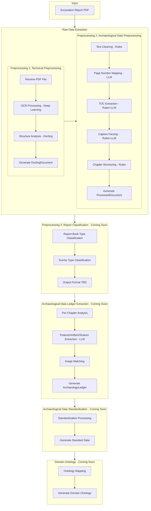
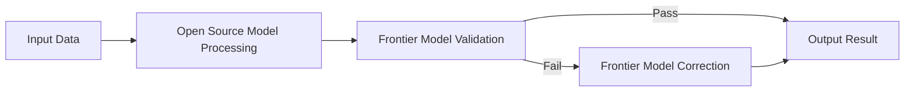
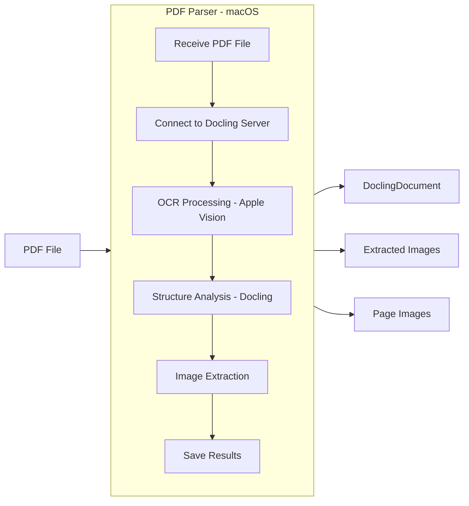
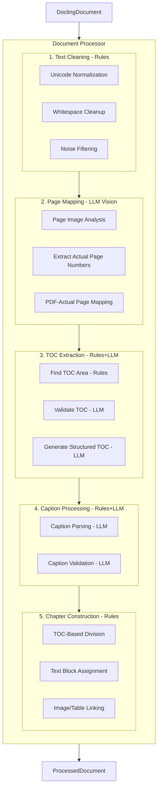
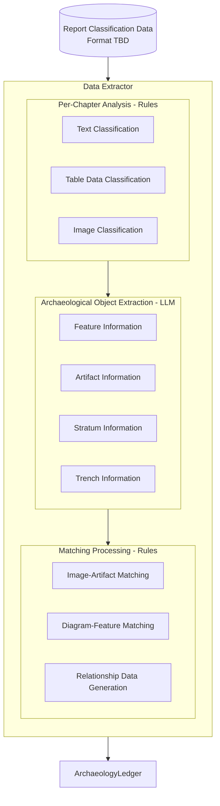
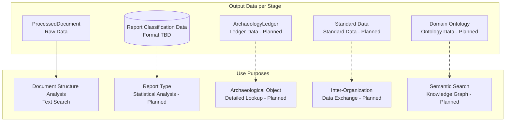

# heripo engine Architecture

## Project Overview

heripo engine is a system that extracts data from **archaeological excavation reports** (PDFs) and transforms them into structured databases.

### Why is This Project Needed?

Archaeological excavation reports are PDF documents spanning hundreds to thousands of pages, containing information such as:

- Stratigraphy information from excavation sites
- Details of discovered features (building sites, tombs, etc.)
- Lists of artifacts (pottery, stone tools, etc.)
- Photographs and diagrams of the excavation process

Manually entering such information into databases is time-consuming and expensive. heripo engine **automates** this process, enabling researchers to quickly utilize the data.

---

## Overall Processing Flow



---

## AI Technology Usage

heripo engine utilizes two types of AI technology:

| Type              | Technology                   | Stage                            | Characteristics                                        |
| ----------------- | ---------------------------- | -------------------------------- | ------------------------------------------------------ |
| **Deep Learning** | Apple Vision Framework (OCR) | Preprocessing 1                  | Text recognition from images, local processing, free   |
| **LLM**           | GPT, Claude, Qwen, etc.      | Preprocessing 2, Main Processing | Text understanding/analysis, API calls, cost per token |

### LLM Model Selection Strategy

To optimize LLM costs, models are differentiated based on task characteristics:

| Model Type              | Use Condition                          | Examples                   |
| ----------------------- | -------------------------------------- | -------------------------- |
| **Frontier Commercial** | Large context or high accuracy needed  | GPT-5.2, Claude Opus, etc. |
| **Open Source**         | Simple tasks, cost efficiency priority | Qwen, DeepSeek, etc.       |

### LLM Validation and Correction System

All LLM processing includes **validation/correction stages using frontier commercial models**:



This system enables:

- **Cost Savings**: Most processing done with low-cost open source models
- **Accuracy Guarantee**: Frontier models validate results for quality assurance
- **Automatic Correction**: Frontier model reprocesses on validation failure

---

## Stage-by-Stage Details

### Input: Excavation Reports

- **Format**: PDF files
- **Characteristics**:
  - Scanned image-based (OCR required)
  - Hundreds to thousands of pages
  - Contains many tables, photographs, diagrams
  - Primarily Korean text

---

### Preprocessing 1: Technical Preprocessing (`@heripo/pdf-parser`)

> **Currently Implemented** ✅

This **technical preprocessing** stage transforms PDF files into structured data that computers can understand.

#### Core Technology: Docling

[Docling](https://github.com/DS4SD/docling) is an open-source document parsing library developed by IBM. It converts various document formats including PDF and DOCX into structured data.

#### Platform: macOS-Only Design

Preprocessing 1 is designed for macOS only, considering **performance** (output quality) and **cost** (machine cost, electricity).

- **OCR Engine**: Apple Vision Framework (deep learning-based)
  - High-performance OCR built into macOS
  - Excellent Korean recognition quality
  - Local processing at no additional cost
- **Recommended Hardware**: Mac mini (M-series)
  - High-performance processing available for under $1,000
  - Low power consumption (reduced server operating costs)



#### Key Features

| Feature                | Description                                            | AI Technology                |
| ---------------------- | ------------------------------------------------------ | ---------------------------- |
| **OCR Processing**     | Text extraction from scanned images (Korean/English)   | Deep Learning (Apple Vision) |
| **Structure Analysis** | Automatic identification of text, table, image regions | Docling (Rules + ML)         |
| **Image Extraction**   | Save all images in document as files                   | -                            |
| **Page Images**        | Save each page as image (for LLM Vision)               | -                            |

#### Output: DoclingDocument

```
DoclingDocument
├── texts[]          # All extracted texts
├── tables[]         # All extracted tables
├── pictures[]       # All extracted image information
└── pages{}          # Page-by-page information
```

---

### Preprocessing 2: Archaeological Data Preprocessing (`@heripo/document-processor`)

> **Currently Implemented** ✅

This stage refines and structures extracted raw data into a **form optimized for archaeological data construction**. It separates documents into chapter units and establishes relationships with images/tables so that the main processing (data extraction) can work efficiently.

#### Design Philosophy: Extreme Cost Efficiency + Self-Validation

Preprocessing 2 is designed with two principles:

1. **Extreme Cost Efficiency**
   - Select optimal LLM model per task (high-performance vs low-cost)
   - Rule-based processing first, LLM only where necessary
   - Minimize API calls through batch processing

2. **Self-Validation Design**
   - Include validation stage for all LLM outputs
   - Automatic reprocessing or fallback on validation failure
   - Simultaneous optimization of accuracy and cost

**Result**: Processing cost of **under $0.50** for thick reports (thousands of pages), **under $0.10** for thin reports



#### Processing Method Classification

| Stage                | Component              | Rule-Based            | LLM                 | Self-Validation        |
| -------------------- | ---------------------- | --------------------- | ------------------- | ---------------------- |
| Page Mapping         | **PageRangeParser**    | -                     | ✅ Vision           | -                      |
| TOC Extraction       | **TocFinder**          | ✅ TOC area search    | -                   | -                      |
| TOC Extraction       | **TocExtractor**       | -                     | ✅ Structuring      | ✅ TocContentValidator |
| TOC Extraction       | **VisionTocExtractor** | -                     | ✅ Vision fallback  | ✅ TocContentValidator |
| Caption Processing   | **CaptionParser**      | ✅ Pattern matching   | ✅ Complex captions | ✅ CaptionValidator    |
| Chapter Construction | **ChapterConverter**   | ✅ TOC-based division | -                   | -                      |

#### Output: ProcessedDocument

```
ProcessedDocument
├── reportId           # Report unique ID
├── pageRangeMap       # PDF page → actual page mapping
├── chapters[]         # TOC-based chapter structure
│   ├── title          # Chapter title
│   ├── textBlocks[]   # Texts within chapter
│   ├── imageIds[]     # Linked image IDs
│   ├── tableIds[]     # Linked table IDs
│   └── children[]     # Sub-chapters
├── images[]           # Image info (captions, positions, etc.)
└── tables[]           # Table info (captions, cell data, etc.)
```

---

### Preprocessing 3: Report Classification

> **Coming Soon** 🔒

This stage classifies report types in detail to facilitate ledger extraction.

#### Classification Targets (Examples)

| Classification Item | Description                      | Examples                                      |
| ------------------- | -------------------------------- | --------------------------------------------- |
| **Book Type**       | Physical composition of report   | Text+Plates, Text only, Comprehensive         |
| **Survey Type**     | Type of excavation               | Excavation, Trial excavation, Surface survey  |
| **Period**          | Primary period of artifacts      | Prehistoric, Three Kingdoms, Goryeo, Joseon   |
| **Site Character**  | Main character of excavated site | Habitation, Burial, Production, Fortification |

#### Output Data

The output format for report classification is not yet finalized. It is planned to be included as metadata for the archaeological data ledger.

---

### Archaeological Data Ledger Extraction

> **Coming Soon** 🔒

Extracts actual archaeological data (features, artifacts, strata, etc.) from classified documents to generate ledger data.

#### Cost Outlook

With documents well-refined in preprocessing stages, LLM costs for main processing are expected to remain low.

- **Goal**: Under **$2.00** total for preprocessing + main processing for thick reports
- **Expected**: Under **$1.00** possible with optimization



#### Processing Method Classification

| Stage                                | Processing Method | Description                                                                       |
| ------------------------------------ | ----------------- | --------------------------------------------------------------------------------- |
| **Per-Chapter Analysis**             | Rule-Based        | Utilizes data already structured in preprocessing, no LLM needed                  |
| **Archaeological Object Extraction** | LLM               | Structuring work requiring domain knowledge for features, artifacts, strata, etc. |
| **Image-Data Matching**              | Rule-Based        | Matching based on caption numbers and text references                             |

#### Extraction Target Data

| Data Type     | Description                     | Examples                         |
| ------------- | ------------------------------- | -------------------------------- |
| **Features**  | Excavated buildings, structures | Dwellings, pits, tombs           |
| **Artifacts** | Discovered objects              | Pottery, stone tools, iron       |
| **Strata**    | Stratigraphy information        | Topsoil, cultural layer, subsoil |
| **Trenches**  | Excavation unit information     | Location, size                   |

---

### Archaeological Data Standardization

> **Coming Soon** 🔒

Transforms ledger data into standardized formats. Normalizes data extracted from various reports into a unified schema.

---

### Domain Ontology

> **Coming Soon** 🔒

Applies domain-specific ontologies to standard data to generate domain-specialized data.

---

### Data Structure and Storage Strategy

#### Independent Data per Pipeline

Data generated at each pipeline stage is **managed independently** and has **different use purposes**. Only the extraction order is dependent; each data can be stored and utilized separately.



#### Data Storage Method (TBD)

The data storage method for heripo engine has not yet been decided:

| Option       | Description                    | Pros                                                | Cons                                    |
| ------------ | ------------------------------ | --------------------------------------------------- | --------------------------------------- |
| **Option A** | Provide TypeScript models only | Flexibility, easy integration with existing systems | Users must implement storage themselves |
| **Option B** | Provide PostgreSQL full set    | Ready to use, storage integrated into each stage    | Locked to specific DB                   |

**If Option B is selected**, database storage will be **integrated into each pipeline stage** rather than being a separate final step.

#### Extensible Storage Structure

Various storage options can be extended depending on future data utilization needs:

| Storage          | Purpose                                                  | Status     |
| ---------------- | -------------------------------------------------------- | ---------- |
| **RDBMS**        | Store structured data with base schema                   | 📋 Planned |
| **Graph DB**     | Ontology-based relationship exploration, knowledge graph | 📋 Planned |
| **Vector Store** | Semantic search, similarity-based exploration            | 📋 Planned |

#### Ontology-Based Schema Extension

After base schema construction, schemas will be extended using **ontology research results for specific periods/domains**:

| Domain               | Ontology Application Examples                            |
| -------------------- | -------------------------------------------------------- |
| **Neolithic**        | Pottery typology, stone tool manufacturing relationships |
| **Tumuli**           | Tomb type hierarchy, burial goods placement patterns     |
| **Historical Ships** | Ship structure terminology, wood species relationships   |

Ontology extension enables:

- **Semantic Search**: Meaning-based searches like "gray-blue hard pottery from Three Kingdoms period dwelling sites"
- **Relationship Inference**: Complex relationship exploration between artifact-feature-period
- **Knowledge Graph**: Visualization of connection networks between archaeological data

---

## Technology Stack

### Core Technologies

| Technology                 | Purpose                                   | Stage                            |
| -------------------------- | ----------------------------------------- | -------------------------------- |
| **TypeScript**             | Overall system development language       | All                              |
| **Docling**                | PDF parsing (open source)                 | Preprocessing 1                  |
| **Apple Vision Framework** | OCR (deep learning)                       | Preprocessing 1                  |
| **AI SDK (Vercel)**        | LLM integration (OpenAI, Anthropic, etc.) | Preprocessing 2, Main Processing |
| **pnpm**                   | Monorepo package management               | All                              |
| **Turbo**                  | Build system                              | All                              |

### Package Structure

```
heripo-engine/
├── apps/
│   └── demo-web/             # Web demo application
├── packages/
│   ├── pdf-parser/           # Preprocessing 1: Technical preprocessing
│   ├── document-processor/   # Preprocessing 2: Archaeological data preprocessing
│   ├── model/                # Data model definitions
│   └── shared/               # Shared utilities
└── tools/
    ├── logger/               # Logging tools
    └── ...                   # Configuration tools
```

### Demo Web Application (`demo-web`)

A Next.js 16-based web application for visualizing and testing the PDF processing pipeline.

**Key Features:**

- PDF upload and processing option configuration (OCR language, LLM model selection)
- Real-time processing progress monitoring (SSE streaming)
- Processing result visualization (chapter tree, image/table viewer, page viewer)
- Token usage analysis and cost calculation
- Result download (ZIP, JSON)

**Technology Stack:**

- Next.js 16 (App Router)
- React Query (server state management)
- shadcn/ui + Tailwind CSS

---

## Processing Cost Summary

| Pipeline Stage                             | AI Type                      | Cost                      | Notes                                               |
| ------------------------------------------ | ---------------------------- | ------------------------- | --------------------------------------------------- |
| **Raw Data Extraction (Preprocessing 1)**  | Deep Learning (Apple Vision) | **Free**                  | Local processing, only machine costs                |
| **Raw Data Extraction (Preprocessing 2)**  | LLM (GPT, Claude, etc.)      | **$0.10-0.50**            | Under $0.10 for thin reports, under $0.50 for thick |
| **Preprocessing 3: Report Classification** | LLM (expected)               | **TBD**                   | Coming Soon                                         |
| **Archaeological Data Ledger Extraction**  | LLM (GPT, Claude, etc.)      | **$0.50-1.50** (expected) | Coming Soon, room for optimization                  |
| **Archaeological Data Standardization**    | Rule-Based (expected)        | **Free** (expected)       | Coming Soon                                         |
| **Domain Ontology**                        | LLM/Rules hybrid (expected)  | **TBD**                   | Coming Soon                                         |

### Cost Reduction Strategies

- **Optimal Model Selection per Task**: Low-cost models for simple tasks, high-performance models for complex analysis
- **Rule-Based Processing First**: Process what can be handled by rules before LLM calls
- **Batch Processing**: Bundle multiple requests to minimize API call count
- **Self-Validation**: Reprocess only failed items to prevent unnecessary costs

---

## Development Status

| Pipeline Stage                         | Output Data                 | Status         | Description                         |
| -------------------------------------- | --------------------------- | -------------- | ----------------------------------- |
| Raw Data Extraction (Preprocessing 1)  | DoclingDocument             | ✅ Complete    | PDF → Structured document           |
| Raw Data Extraction (Preprocessing 2)  | ProcessedDocument           | ✅ Complete    | DoclingDocument → Chapter structure |
| Preprocessing 3: Report Classification | (Format TBD)                | 🔒 Coming Soon | Report/survey type classification   |
| Archaeological Data Ledger Extraction  | ArchaeologyLedger (Planned) | 🔒 Coming Soon | Archaeological data extraction      |
| Archaeological Data Standardization    | Standard Data (Planned)     | 🔒 Coming Soon | Standard schema conversion          |
| Domain Ontology                        | Domain Ontology (Planned)   | 🔒 Coming Soon | Domain ontology application         |
